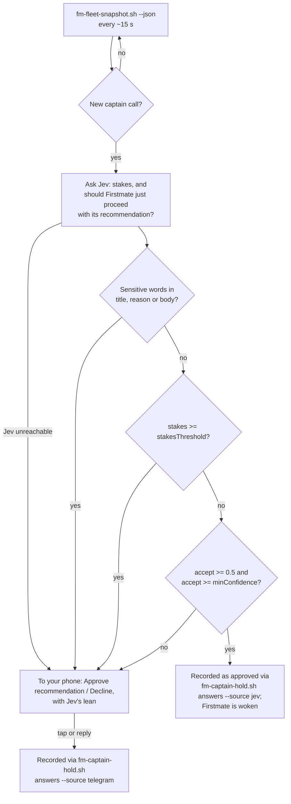

# Firstmate Integration

[Firstmate](https://github.com/kunchenguid/firstmate) is an open-source engineering lead that runs a fleet of Claude Code workers and pauses on "captain calls" for its human. jev-autopilot works with it but is not part of it, and is not affiliated with or endorsed by its author, Kun Chen.

In a Firstmate checkout the plugin turns captain calls into Jev decisions or Telegram prompts, records the answers through Firstmate's own intake, tells you when tasks land, and treats Firstmate's worker steering and its pipeline's scratch directories as internal. Workers launched by Firstmate are screened but never talk to Telegram; they route decisions back to Firstmate. Outside a Firstmate checkout there is no Firstmate behaviour at all.

## Detection

Detection is automatic but strict, because the plugin **executes** `bin/fm-fleet-snapshot.sh` and `bin/fm-captain-hold.sh` from the detected folder on a timer. The session's working directory is a Firstmate home only if **all** of these hold:

1. it contains `bin/fm-captain-hold.sh` and `AGENTS.md`;
2. it is the top level of a git repository (`git rev-parse --show-cdup` is empty);
3. its `origin` or `upstream` remote is `github.com/kunchenguid/firstmate` (https, ssh, scp-style, with or without `.git`, any case: all normalise to the same), **or** the remote or the folder itself is listed in the `firstmateRemotes` option (a remote URL, or an absolute path such as `/home/sam/firstmate`, `~/firstmate` or `C:\…`);
4. both scripts are tracked by git (`git ls-files --error-unmatch`) and have no uncommitted changes (`git status --porcelain`) against the checked-out `HEAD`. How old that `HEAD` is does not matter: a checkout that has not pulled in months is still a Firstmate home.

Rule 4 is **re-checked right before every run** of either script, so an edit made after detection stops them: a toast `not running Firstmate scripts (uncommitted changes in bin/fm-captain-hold.sh)` at most every 10 minutes, and a log entry `not run: …`.

Detection happens once per load of the mod, from the session's working directory. `/autopilot status` prints `Firstmate: detected (genuine checkout, scripts tracked and unmodified)` or `not detected (<reason>)`, where the reason is one of: `bin/fm-captain-hold.sh is missing`, `AGENTS.md is missing`, `not a git repository`, `not the top level of its git repository`, `neither origin nor upstream points at github.com/kunchenguid/firstmate`, `a Firstmate script is not tracked by git`, `git status failed`, or `uncommitted changes in <files>`.

## Roles

Each session gets one role when the mod loads:

| Role | When | Status line |
| --- | --- | --- |
| `supervisor` | `FM_SUPERVISION_ACTOR` is set (Firstmate's headless supervision host) | none |
| `worker` | `FM_TASK_ID` or `FM_TASK_INBOX` is set (Firstmate exports both into every crewmate it launches) | `autopilot ● worker (screening only)` |
| `captain` | neither is set and the working directory is a Firstmate home | `autopilot ● firstmate` |
| `solo` | everything else | `autopilot ●` |

### Supervisor

Autopilot stays out of the session entirely: no standing prompt, no screening, no question handling, no Telegram, no status line, no state notices.

### Worker (crewmate)

- Tool calls are screened by Jev like anywhere else. A held call is **denied** with: "Autopilot (Jev) blocked this call as destructive (p=0.90). Do not retry it or work around it. You are a Firstmate crewmate: report it to firstmate by appending a needs-decision line to your task status file, as your brief describes, then wait for its answer." Logged as `blocked, routed to firstmate`.
- Questions: Jev's auto-answers still apply. An escalated question is denied with "This needs a decision above you (high-stakes)." and the same crewmate instruction. Logged as `routed to firstmate`.
- The standing prompt is the short crewmate version (see [[How Autopilot Works]]).
- Never polls Telegram, never sends to it, never nudged, never relays replies. Scratch roots and internal-coordination criteria of a Firstmate session still apply to it.

### Captain (Firstmate itself)

Everything a solo session does, plus the fleet duties below, with these differences:

- The captain session is **preferred for the Telegram listener** lease.
- The keep-going check runs from the background tick once the session has been quiet for 2 minutes after its last turn, never at turn end, and never while any fleet task is running.
- End-of-turn `Finished`/`waiting` notices are replaced by the fleet notice below, because Firstmate's chat mentions every project in the fleet.
- Shell commands that only run `bin/fm-send.sh` or `bin/fm-wake-drain.sh` from the home, with plain arguments, are not screened. Jev is also told that Firstmate's internal coordination with its own workers (its `bin/fm-*.sh` scripts, tmux steering, no-mistakes runs) is not outward-facing, and `~/.no-mistakes/worktrees/` and `~/.no-mistakes/evidence/` are added to the scratch roots.
- The standing prompt adds: hold captain calls as usual, but keep dispatching and supervising every other task while they wait.

## Captain calls

Every fifth tick (about every 15 seconds) while autopilot is on and this session holds the listener, the captain session runs `bin/fm-fleet-snapshot.sh --json` (20-second timeout) and reads `backlog.records`. A record with `hold_kind: "captain"`, `captain_actionable: true` and an id is an open captain call. Its key is the id plus a hash of the hold reason, so a task re-held with a new reason counts as a new call; each key is handled once.

The decision, in order:

1. The title, reason and body are checked for words Jev may never decide: delete/drop/destroy/wipe, irreversible, security/credential/secret/token/password, production, force-push, billing/payment/money, legal, license, public/publicly/announce, customer data. A match escalates with reason `sensitive`.
2. `stakes >= stakesThreshold` escalates with `high-stakes`.
3. Jev's `accept` probability below 0.5 escalates with `Jev would not approve it`.
4. `accept` below `minConfidence` escalates with `Jev unsure`.
5. Otherwise Jev **approves**.

**Approval by Jev** writes one line to `bin/fm-captain-hold.sh answers --any-origin --source jev` on stdin (tab-separated: id, answer, label, mode) with the answer `Approved: proceed with your recommendation.` and the label `Decided by Jev under the owner's standing autopilot delegation (stakes 0.12, confidence 0.88) - not the owner's own words`. The mode is `release` when the call carries a PR URL, otherwise `done`. The captain session then gets a prompt: "Captain call <id> has been answered and recorded (Jev (automated decision model) decided this under the owner's standing autopilot delegation; it is not the owner's own words): "<answer>". Run your wake drain and continue." Your phone gets `🤖 Jev approved firstmate's call <title> (stakes 0.12, conf 0.88).`

**Escalation** sends `⚓ Firstmate needs the captain (<reason>) · <project>` with the title, the reason, the detail, the PR link, `Jev leans: approve|decline`, and two buttons: **✅ Approve recommendation** and **❌ Decline**. A tap records `Approved: proceed with your recommendation.` or `Declined: do not proceed with this. Hold off and propose an alternative.` with the label `<owner> via Telegram: <button>`; a reply in your own words records your text with the label `<owner> via Telegram (in <owner>'s own words)`. The chat gets `✅ Recorded for firstmate: …` or `✅ Recorded for firstmate in your words.`, and the captain session gets the same "answered and recorded" prompt, attributed to you in person.

If the intake script exits non-zero, nothing is recorded, the log says `intake failed: …`, and the chat gets `⚠️ Could not record the answer for <id> in Firstmate: …`.

## Landed and finished notices

From the same snapshot:

- **Landed:** every structured record in state `done` that has not been announced gets `✅ Landed (merged|reported|done) · <project>` with the title and PR URL. The first read after autopilot is turned on only records what is already done, so history is not replayed.
- **Finished:** when the number of running tasks (`current_role` of `worker` or `program`) drops from more than zero to zero, `🏁 Finished · <project> / All running work has landed.` followed by up to eight titles still waiting on you (`hold_kind: captain`, actionable) or `Nothing is waiting on you.` Open decisions are listed, not announced on their own, because each already reached you as its own prompt when it was raised.

## What the plugin never does in a Firstmate home

- Run anything other than the two scripts above, and only when they are tracked and clean.
- Answer a sensitive or high-stakes call itself.
- Let a worker reach your phone, or let a worker's questions be routed anywhere but Firstmate.
