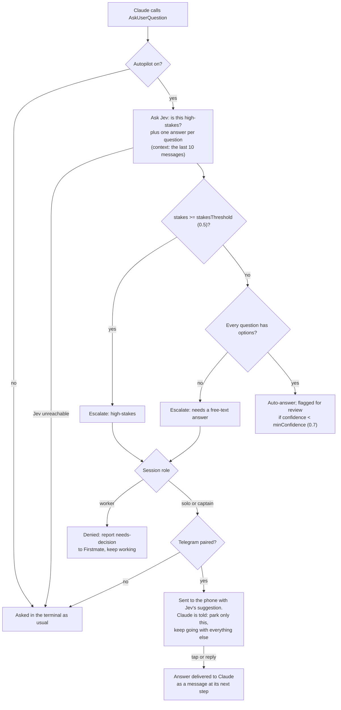
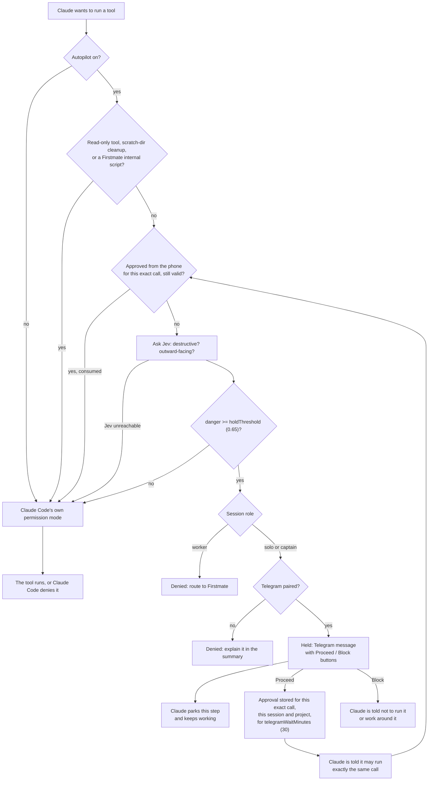

# How Autopilot Works

This page follows the code in `hooks/register.ts` (the wiring) and `hooks/core.ts` (the pure decision logic). Numbers such as thresholds are the defaults; see [[Secrets and Configuration]] for how to change them.

## The switch

Autopilot is on when either of these holds:

- `/autopilot on` was run in any session on this machine (the plugin stores `enabled: true` in Claude Code's plugin store, which is one store per plugin, shared by every session and every project on the machine), or
- the process environment has `JEV_AUTOPILOT=1`.

`/autopilot off` clears the stored flag. The switch is therefore **machine-wide**, not per project. Every session runs a background tick every 3 seconds that redraws the status line when the state changed, so a switch made in one window appears in the others within a few seconds. A session that sees a new state also tells Claude once, in context, that autopilot is now on (or off) for every session on this machine; that notice rides on the next prompt or the next tool result.

With autopilot off the plugin does nothing except keep its slash command, keep the status line clear, and deliver that one-line notice.

## The standing prompt

While autopilot is on, every prompt Claude composes gets an extra section (`prompt.compose`). Its text depends on the session's [[role|Firstmate Integration]]:

- **Solo** (the normal case): the owner is away; never end the turn just to wait for them while other work can proceed; ask decisions with `AskUserQuestion` (it reaches the phone, or Jev answers it) and then continue with other work; park only the work that depends on the open decision; stop only when everything left is blocked or done; never contact the owner directly and never read the plugin's credentials or store.
- **Captain** (Firstmate itself): the solo text plus: hold captain calls as usual but keep dispatching and supervising every other task while they wait.
- **Worker** (a Firstmate crewmate): a one-paragraph version: never wait idle on a decision, report it to Firstmate as `needs-decision`, keep working on what does not depend on it, never contact the owner or read the plugin's data.
- **Supervisor** (Firstmate's headless host): no section at all. Autopilot stays out of that session entirely.

## Questions

Claude asks questions with the `AskUserQuestion` tool. With autopilot on, the plugin intercepts that call.

In detail:

1. The plugin builds one Jev request holding a **stakes** question ("is this a high-stakes decision the human owner should make themselves?") and, for each question Claude asked, either a **choice** question over its options or, for a multi-select question, one yes/no question per option. The context is the project path, the last ten conversation messages (up to 6,000 characters) and the questions with their options.
2. `decideQuestions` turns Jev's answers into a decision:
   - stakes at or above `stakesThreshold` → **escalate** (reason `high-stakes`);
   - any question without options, or a Jev answer that does not name an option → **escalate** (reason `needs a free-text answer`);
   - otherwise **auto**, with the confidence being the lowest confidence across the questions (for multi-select options, how far Jev's probability is from 0.5). Below `minConfidence` the answer is flagged for review.
3. An **auto** answer is returned to Claude as the tool result, with a note in context: either "Jev answered this on the owner's behalf, keep going" or, when flagged, "Jev answered with LOW confidence: implement this choice in the most reversible way, note the assumption, and keep going". A toast says `Jev answered (conf 0.82)` (with `, flagged` when flagged).
4. An **escalated** question goes:
   - in a **worker** session, back to Claude as a denial telling it to report a `needs-decision` line to Firstmate;
   - when Telegram is not paired or has no token, to the terminal as usual (logged as `human-terminal`);
   - otherwise to the phone: one Telegram message per question, each with a button per option and Jev's suggested answer, and Claude gets a denial that says the answer will arrive later, not to wait or decide it itself, and to park only the dependent work.
5. If Jev fails (no key, network, HTTP error) the question is asked in the terminal and a toast says `Jev failed (…); asking you here`.

Answers from the phone (a button tap or a reply to the message, in your own words) land in the asking session's inbox and are delivered to Claude as a message prefixed with "the owner's answer to your earlier question …" (see [Delivery](#delivery-how-phone-messages-reach-claude) below).

## Tool calls

Every tool call other than `AskUserQuestion` goes through the second hook.

Step by step:

1. **Never screened:** read-only tools (`Read`, `Grep`, `Glob`, `LS`, `ToolSearch`, `WebSearch`, `WebFetch`, `TodoWrite`, `TaskList`, `TaskGet`, `ListMcpResourcesTool`, `ReadMcpResourceTool`, `AskUserQuestion`, `EnterPlanMode`, `ExitPlanMode`, `Skill`). Also a shell command that does nothing but delete scratch directories under the configured `tempRoots`, and, in a Firstmate captain session, a command that only runs Firstmate's internal steering scripts. The supervisor role is never screened.
2. **A standing approval.** The plugin computes a key for the exact call: session id, project directory, tool name and the input (minus `description`, `timeout` and `run_in_background`). If an approval is stored under that key it is deleted (an approval is good once); if it has not expired the call is let through and logged as `let through after approval`. An expired one is logged as `approval expired; screened again` and screening continues.
3. **Jev screening.** Jev gets a description of what the call *does* (the command with heredoc bodies collapsed and scratch-dir deletions rewritten as `rm -rf <temporary scratch dir>`, or "edit a file inside/OUTSIDE the project directory: path", or the tool name and its input), the working directory and up to 600 characters of your last prompt. Two probabilities come back: **destructive** (permanently destroys or irreversibly overwrites something) and **outward** (exposes something to other people or the open internet: secrets to third parties, publishing or deploying, messaging other people, posting on repositories the owner does not own, spending money). `judgeTool` takes the larger of the two as the danger; the risk is `safe` below 0.25, otherwise whichever of the two was larger; the call is **held** when the danger is at or above `holdThreshold`.
4. **Not held:** the call proceeds to Claude Code's own permission mode. Calls rated `safe` are not logged; the rest are logged as `allowed`.
5. **Held:**
   - a **worker** gets a denial saying Jev blocked the call and to report it to Firstmate (logged `blocked, routed to firstmate`);
   - without Telegram, Claude gets a denial saying the call was held and Telegram is not set up, not to retry, and to explain it in its summary;
   - otherwise the phone gets a **Tool call on hold** message with the tool summary (commands cut to 400 characters), Jev's risk and danger score, and **Proceed** / **Block** buttons. Claude gets a denial that says to park this step, keep going, and that a message will tell it if the owner approves (then it may run exactly the same call) or blocks.
6. **Proceed** stores an approval under the call's key, valid for `telegramWaitMinutes` from the tap, and sends Claude "APPROVED: you may now run exactly this held call (same command/input)". When Claude retries the identical call, step 2 lets it through **to Claude Code's permission mode**, which still applies: in auto mode, for example, a force push you approved can still be denied, and Claude will tell you so. **Block** sends "BLOCKED: do not run this held call or work around it". A reply in your own words is delivered as "Direction on the held call (…): your text".
7. **Jev unreachable:** the call passes on to Claude Code's permission mode unscreened, and a toast says so at most once a minute. There is deliberately no rules-based fallback that pretends to screen (see [[Jev and TypeSafe]]).

## Keep going

When a turn ends, the plugin asks Jev whether Claude stopped while other work could proceed. The rules differ by role:

- **Solo:** checked at the end of a turn, at most once every 5 minutes, and only when the turn did not end on an API error (a revoked sign-in or an outage; a nudge would fail the same way) and this session holds the Telegram listener lease.
- **Captain:** Firstmate ends a short turn on every crew update, so instead the background tick checks the last turn once it has been quiet for 2 minutes, and never while any fleet task is running.
- **Worker** and **supervisor:** never nudged.

Jev gets up to 1,500 characters of your last real prompt (earlier nudges are filtered out) and up to 3,000 characters of Claude's final message, and answers three probabilities: **done**, **asksHuman** and **proceedable**. The plugin nudges when `done < 0.5` and `proceedable >= 0.5`: a toast `work remains, nudging Claude to keep going` and a new prompt beginning `Autopilot keep-going:` that tells Claude the owner is away, to make sure anything needing a decision was asked with `AskUserQuestion`, to park only that, and to continue.

Nudges are capped at **three** since you last typed a prompt yourself (a prompt submitted by a plugin or a wake-up does not reset the budget), and a nudge that produced a turn with no tool calls ends the nudging early. When Jev does *not* nudge, a notice may go to Telegram instead: **Finished** when `done >= 0.7`, or **Everything remaining is waiting on you** when `asksHuman >= 0.5` and `proceedable < 0.5`. The waiting notice is sent at most every 20 minutes; a finish always gets through; neither repeats for the same words, and a reply already relayed to Telegram is not sent again. In a captain session these notices come from Firstmate's backlog instead (see [[Firstmate Integration]]).

## Delivery: how phone messages reach Claude

Each session has its own inbox in the plugin store, so an answer reaches the session that asked. Messages are delivered in one of two ways:

- **Mid-turn:** attached to the context of Claude's next main-loop tool result (not a subagent's, and not a denied call). The phone gets a receipt `✅ Claude has read this.`
- **When idle**, or when a turn has gone a minute without a tool call: submitted as a new prompt, at most once every 10 seconds. The receipt reads `✅ Delivered — Claude is on it.` or, mid-turn, `✅ Queued for Claude right after its current step.`

Either way the text Claude sees starts with "Message from the owner via Telegram (the owner is away from the terminal; treat this as direction from them)". When the message was one you wrote in person (not a verdict on a held call), Claude is also told that its final reply this turn goes back to you on Telegram and to keep it short and phone-readable. That reply is sent as a Telegram reply to your message, converted from markdown to Telegram HTML, in up to four messages of 4,096 characters; the rest is cut with a note pointing at the terminal. Should Telegram refuse the HTML, the same words are resent as plain text.

## What is stored where

| Where | What |
| --- | --- |
| Claude Code's plugin store (machine-wide) | The switch, the Telegram listener lease, the paired chat id, a pending pairing code, the Telegram update offset, pending prompts and the message ids they were sent as, approvals, per-session inboxes, per-session "state last seen" flags, and Firstmate bookkeeping (holds already handled, tasks already announced). |
| `~/.claude/jev-autopilot/secrets.env` | Your secrets. Read, never written, except by `/autopilot setup` creating it from a commented template. |
| `~/.claude/autopilot/decisions.jsonl` | The [[Decision Log]]. |
| Plugin options (`/plugin configure`) | `ownerName` and the thresholds; see [[Secrets and Configuration]]. |

Module state (which turn is running, the last tool, nudge counters) lives in memory and is rebuilt when the mod reloads, which only drops in-flight waits.
