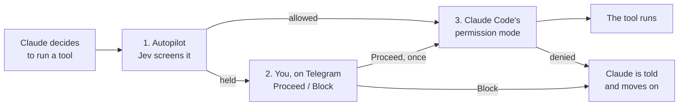

# Safety Model and Permission Layering

jev-autopilot lets an automated model and a Telegram chat steer a Claude Code session that nobody is watching. This page lays out the layers between Claude and a harmful action, what each one does and does not catch, and the threat model the plugin is designed around.

## The layers

Between Claude deciding to run a tool and the tool running, with autopilot on:

1. **Jev screening** (this plugin). Holds calls whose danger reaches `holdThreshold`. It judges what the call *does*, from the command or path, not the content being written. It never screens read-only tools, scratch cleanup, Firstmate's internal scripts, or the supervisor role.
2. **You, by phone.** A held call waits for Proceed or Block. Nothing runs while it waits; Claude parks that step and continues with other work.
3. **Claude Code's own permission mode.** Always applies, approved or not. In the default mode it asks in the terminal; in auto mode its classifier can refuse a call. Either way the plugin never grants anything the permission mode would not: a **Proceed** only takes the call past *autopilot*.
4. **Firstmate supervision** (worker sessions). A crewmate never reaches Telegram; held calls and escalated questions are denied with instructions to report `needs-decision` to Firstmate, which decides or asks the captain.

### How the layers interleave

Observed in live runs with Claude Code's auto mode: the permission mode can refuse a call **before** the plugin's hold ever reaches your phone (so no button appears), and it can refuse a call **after** you tapped Proceed. Both are by design. The decisions log records an approved call as `let through after approval`, not as having run, for exactly this reason. Claude tells you in its summary when an approved call was then denied.

## Approvals are narrow

A **Proceed** tap creates one approval, keyed on:

- the session that held the call,
- the project directory,
- the tool name, and
- the exact input, minus `description`, `timeout` and `run_in_background` (a retried call may word its description differently).

It is consumed by the next matching call (approved or expired, the stored approval is deleted when it is checked), and it expires `telegramWaitMinutes` (default 30) after the tap. A differently worded command, another session, another project, or a call after the window is screened again. Note the flip side: if Claude re-issues an *identical* command later for a different reason, inside the window and before the first retry consumed the approval, that one runs on the earlier approval. The log shows it.

## What is never held

- Read-only tools: `Read`, `Grep`, `Glob`, `LS`, `ToolSearch`, `WebSearch`, `WebFetch`, `TodoWrite`, `TaskList`, `TaskGet`, `ListMcpResourcesTool`, `ReadMcpResourceTool`, `AskUserQuestion`, `EnterPlanMode`, `ExitPlanMode`, `Skill`.
- A shell command that does nothing but delete under `tempRoots` (never `/tmp/` or `/tmp/*` themselves, never a path with `..`). See [[Secrets and Configuration]] for the exact rule.
- In a Firstmate captain session, a command that only runs `bin/fm-send.sh` or `bin/fm-wake-drain.sh` from the detected Firstmate home with plain arguments. The check fails closed: any quoting that could expand, any other word, and the command is screened.
- A call with a valid phone approval.

Everything else goes to Jev, including calls made by subagents (they are screened and held like main-loop calls, but inbox messages and state notices are only attached to main-loop results).

## Calls Jev may never take for you

For Firstmate captain calls, a title, reason or body matching any of these words goes to your phone whatever Jev scores: delete/drop/destroy/wipe, irreversible, security/credential/secret/token/password, production, force-push, billing/payment/money, legal, license, public/publicly/announce, customer data. (For ordinary questions and tool calls Jev's stakes and danger scores decide; the criteria it is given name the same things.)

## Threat model

- **The paired chat is root.** Anyone who holds it can direct the session, approve held calls and stop turns, which is the point. Pair from a private chat you control, on a bot only this machine uses. Pairing is guarded by a 10-character random code (50 bits) that expires in 10 minutes and burns after three wrong guesses; groups cannot pair; messages from any other chat are dropped without a reply; `/autopilot unpair` revokes.
- **Secrets.** The bot token and API key are read from a mode-0600 file rather than the environment, so a shell command cannot print them by accident, and they are redacted from everything the plugin logs, throws or sends (the values themselves, plus bearer headers, Telegram token shapes, common API key prefixes and `token=`/`key=`-style assignments). A model with shell access can still read any file you can, so the standing prompt also tells Claude never to read the plugin's credentials or store. Treat that as a convention, not a wall. Rotate the bot token if you suspect exposure.
- **Code execution from the workspace.** The Firstmate integration is the only path that runs anything from the working directory, and it requires a genuine Firstmate checkout: the right files, the top level of a git repository, `origin` or `upstream` at `github.com/kunchenguid/firstmate` (or a remote or path you listed in `firstmateRemotes`), and the scripts it would run tracked by git with no uncommitted changes, re-checked right before every run. A cloned repository that merely contains the same file names runs nothing. See [[Firstmate Integration]].
- **Prompt injection.** Jev sees the command text; a model steered by hostile tool output could word a command to look routine. Keep Claude Code's permission mode on, keep `holdThreshold` conservative, and review the [[Decision Log]].
- **Jev down.** Calls pass through to Claude Code's permission mode, unscreened by the plugin, with a toast. No fake screening. See [[Jev and TypeSafe]].
- **Autopilot is machine-wide.** Switching it on in one project switches it on for every session on the machine. Do not leave it on in a session that should stay interactive.

## Reporting a vulnerability

Do not open a public issue. Use GitHub's private vulnerability reporting on the repository ("Report a vulnerability" under the Security tab) or email the maintainer at the address on their GitHub profile, with the plugin version, your Claude Code version and steps to reproduce. Only the latest release is supported. In scope: any chat other than the paired one steering a session, approving or pairing; a cloned repository running code through the Firstmate integration without being a genuine checkout; a token or key reaching the log, a toast, a Telegram message, an error or the model's context; a tool call bypassing screening in a way this page says it should not. Out of scope: a stolen phone or Telegram account; a model reading the secrets file through the shell; Jev's judgement itself.
